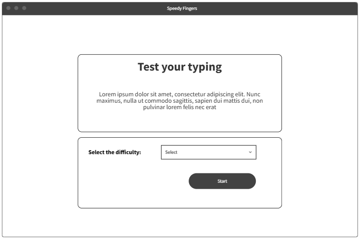
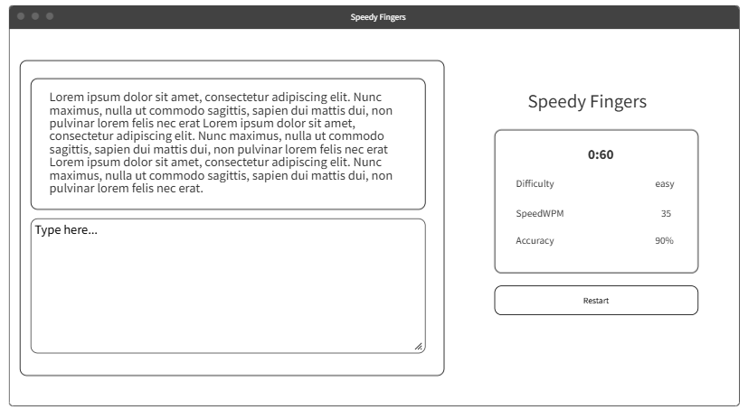

 
 

# Speedy Fingers

[Play the Game](https://speedy-fingers.surge.sh/)

## Date: 6/29/2025

### By: Zeshan Ahmed

[LinkedIn](https://www.linkedin.com/in/zeshan-ahmed-bh/) | [GitHub](https://github.com/zeshan2001)

---

### **_Description_**

The Speedy Fingers is an interactive typing test game that helps users evaluate their typing speed (in words per minute) and measure the accuracy of their keystrokes in real-time.

---

**_Technologies Used_**

- HTML
- CSS
- JavaScript
- MockFlow (Wireframe)

---

**_Screenshots_**

#### Home Page

#### Play Page

---

**_Pseudo-code_**

- Declare variables:

  - time (number)
  - difficulty (string)
  - easySentences (array)
  - mediumSentences (array)
  - hardSentences (array)

- Once the user click start button:

  - assign (difficulty) from user input.
  - redirect the user to the play page.

- Display timer and difficulty on the page.

- Select sentences array based on chosen difficulty:

  - if difficulty === "easy", then use easySentences[].
  - else if "medium", then use mediumSentences[].
  - else, use hardSentences[].

- Use random method to select a sentence from the selected array.

- Display the selected sentence for the user to type.

- Start the countdown timer when typing begins.

- When timer === 0:

  - stop user input.
  - calculate the words per minute (WPM):
    - equation: WPM = (correct words / total time in minutes).
  - calculate the accuracy:
    - equation: accuracy = (correct characters / total time in minutes).

- Display results to the user.

- Compare each typed character with the actual sentence in real-time:
  - if the character is incorrect, Change its color to red otherwise, green

---

**_Credits_**

TypingTest.com: [click here](https://www.typingtest.com/)

docs.vultr.com: [click here](https://docs.vultr.com/javascript/examples/create-countdown-timer)

shecodes.io: [click here](https://www.shecodes.io/athena/27074-understanding-window-location-search-and-urlsearchparams-in-javascript)
